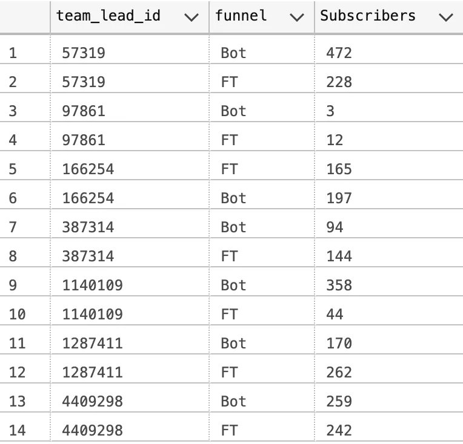
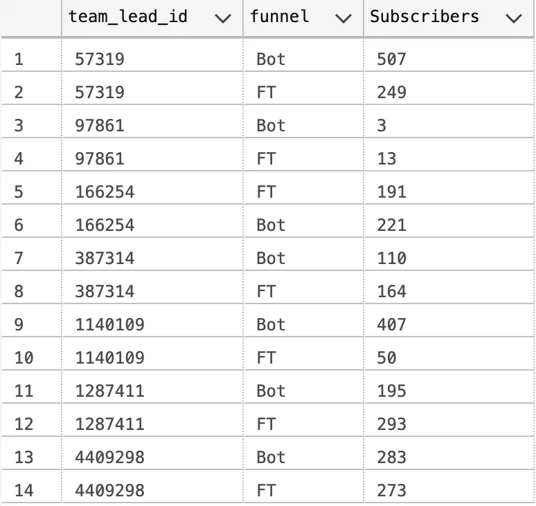
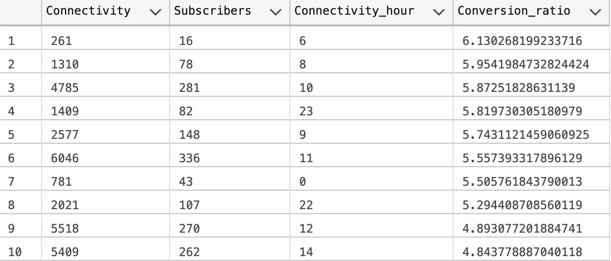
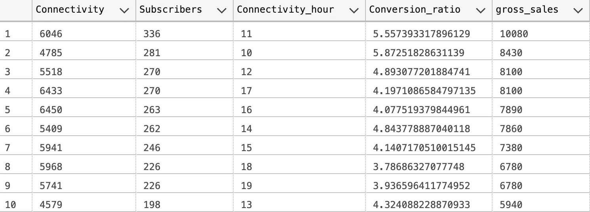

# Sales-Conversion : Analysis using SQL
# Improving the efficiency of sales Conversion 


# Business Case Study : Improving the efficiency of sales Conversion

The below problem statement is an original case study assignment given by an established healthcare start-up for the senior business analyst role.

Attached is a dump of slots booked by free users over 2 months with our coaches. The leads are separated by funnel — Bot / Free-Trial and Lead Type — With/without medical condition and India/NRI. All consultations are free, and the objective is to upsell premium subscriptions. Purchase can be identified with the payment time filter. Coaches are divided into Target Classes basis their ability to sell. ‘A’ being the best in sales and ‘D’ being the worst. The data of the actual users and coaches have been masked.

1. What’s the 3-day and 7-day conversion of different lead types split by funnels?  
2. What hours work best for connectivity and sales?  
3. Come up with insights on how best you would optimize slots, coach, and funnel for the most efficient outcome.  
Are there any other insights you can come up with using this data?

# Load and Summarise Data.
Dataset download : (http://localhost:8888/files/health.csv?download=1)
The dataset was loaded in the Azure Data studio with table name health and viewed using the following query.

```sql
Select *
From dbo.health
```

The dataset is made up of 13 Columns ,explanation of the column was not provided ,assuming the column description

**expert_id** — ID of the sales representative.  
**team_lead_id** — ID of the team lead.  
**user_id** — User id.  
**India vs NRI** — whether Indian or not.  
**medicalconditionflag** — Any medical condition or not.  
**funnel** — Source of the lead, BOT or FT(Free Trial).  
**event_type** — The purpose of the call is either to book a consultation or a sales call.  
**current_status** — Current status of the event.  
**handled_time** — Conversation time between agent and user.  
**slot_start_time** — Consultation start time.  
**booked_flag** — Consultation booked or not.  
**payment_time** — Subscription activation time.  
**target_class** — Class of users.  

Based on the type of data we are working with , I assumed the following for null values in some of the columns ;

**handled_time** — Conversation between agent and user never existed  
**slot_start_time** — User did not go ahead to book consultation  
**payment_time** — User did not subscribe , as it was inferred from the problem statement “Purchase can be identified with the payment time filter”.  

In other to determine the number of users that were reached out to and the number of users that booked a slot , the following queries were executed respectively

```sql
Select Distinct count(user_id) as User_reached_out_to
From dbo.health 
Where booked_flag is not null ;
```

```sql
Select Distinct count(user_id) as User_booked_slot
From dbo.health 
Where booked_flag = 'Booked' ;
```

## What’s the 3-day and 7-day conversion of different lead types split by funnels?  

To conduct an analysis on our dataset aimed at computing the 3-day and 7-day conversion rates, we must first establish the specific conversion metric.  
While conversion is typically associated with slot bookings (i.e., users booking consultations), in the context of this particular case study,  
it has been explicitly defined as sales conversion. To determine the conversion window,   
we need to compute the time difference between payment timestamps and slot timestamps.

Upon closer examination of the dataset, I observed instances where the slot timestamp was earlier than the handled timestamp.  
In response, I executed a query to select the maximum time between the handled timestamp and slot timestamp(Max_handled_slot_time),  
resulting in the creation of a new table named **“health_cleaned2”** to store our cleaned dataset.

```sql
Select *,
       (select Max(Max_handled_slot_time)
               From (Values 
               (handled_time) ,
               (slot_start_time)) As Value(Max_handled_slot_time) ) 
        AS Max_handled_slot_time
From dbo.health;
```

```sql
Select *,
       (select Max(Max_handled_slot_time)
               From (Values 
               (handled_time) ,
               (slot_start_time)) As Value(Max_handled_slot_time) ) 
        AS Max_handled_slot_time 
Into dbo.health_cleaned2
From dbo.health ;
```
Perform the computation of “Conversion days,” defined as the difference between the maximum “start_handled_time” and the “payment_time,” utilizing the SQL query.  
Subsequently, generate a dedicated table named “health_conversions” to house the resulting data for subsequent data analysis.

```sql
Select *
       ,DATEDIFF(Day ,Max_handled_slot_time,payment_time) as Conversion_days
From dbo.health_cleaned2
where payment_time  is not null;
```

```sql
Select *
       ,DATEDIFF(Day ,Max_handled_slot_time,payment_time) as Conversion_days
Into dbo.health_conversions
From dbo.health_cleaned2
where payment_time  is not null;
```

As it was specified to determine the conversion of different lead type split by funnel ,this was achieved using the query ;

```sql
Select team_lead_id
       ,funnel
       ,Count(Conversion_days) as Subscribers
From dbo.health_conversions
Group by team_lead_id ,funnel ;
```
**For 3 day Conversion** i.e the number of users that subscribed within 3 days after consultation time

```sql
Select team_lead_id
       ,funnel
       ,Count(Conversion_days) as Subscribers
From dbo.health_conversions
where Conversion_days <= 3
Group by team_lead_id ,funnel
Order by team_lead_id ;
```


**For 7 day conversion** i.e the number of users that subscribed within 7 days after consultation time

```sql
Select team_lead_id
       ,funnel
       ,Count(Conversion_days) as Subscribers
From dbo.health_conversions
where Conversion_days <= 7
Group by team_lead_id ,funnel
Order by team_lead_id;
```


**What hours work best for connectivity and sales?**
Hours that work best for connectivity and sale is the hours that yield a higher number of subscribers and a superior conversion rate.”

```sql
Select Top 10 Count(Max_handled_slot_time) as Connectivity 
      ,Count(payment_time) as Subscribers ,DATEPART(Hour,Max_handled_slot_time) as Connectivity_hour 
      ,Count(payment_time) /Cast(Count(Max_handled_slot_time) as float ) *100 as Conversion_ratio
From dbo.health_cleaned2
Group by DATEPART(Hour,Max_handled_slot_time)
Order by Conversion_ratio DESC ;
```


Examining the data table provided, it becomes evident that 6 AM boasts the highest conversion ratio.   
However, it’s important to note that the subscriber count during this hour is relatively low in comparison to other times of connectivity.   
It is imperative to remember that the primary objective of any institution is to secure substantial revenue. In the context of a marketing team,  
achieving a high conversion ratio is a paramount goal. Nevertheless, given the limited number of subscribers during this period,   
attaining a significant revenue target becomes challenging.

Assuming a subscription fee of £30, we can now proceed to calculate the gross sales for each connectivity hour.  
This can be accomplished utilizing the following query

```sql
Select Top 10 
       Count(Max_handled_slot_time) as Connectivity 
      ,Count(payment_time) as Subscribers ,DATEPART(Hour,Max_handled_slot_time) as Connectivity_hour 
      ,Count(payment_time) /Cast(Count(Max_handled_slot_time) as float ) *100 as Conversion_ratio 
      ,Count(payment_time) *30 as gross_sales 
From dbo.health_cleaned2
Group  by DATEPART(Hour,Max_handled_slot_time)
Order by gross_sales DESC;
```


Based on the data presented in the table, it is evident that 11 AM emerges as the most optimal time for both connectivity and sales. In general, the hours spanning from 10 AM to 12 PM exhibit the highest performance in terms of connectivity and sales.

## Come up with insights on how best you would optimize slots, coach, and funnel for the most efficient outcome.

In order to optimize appointment slots for a more efficient outcome, given our findings that 10 AM to 12 PM is the most effective time for connectivity,  
we should allocate consultation slots with lower connectivity rates to new users.  
Additionally, it is advisable to assign agents with a track record of effective conversions to these consultation times to maximize their impact.

The seven-day conversion rate is only marginally higher than the three-day conversion rate, showing an increase from 31% to 33% and from 35% to 39% respectively.  
To further boost the seven-day conversion rate, it is recommended to introduce compelling subscription offers once the initial three-day period has elapsed.  
This strategic move has the potential to raise the seven-day conversion rate by a percentage (X%) that can be calculated based on the outcomes of previously conducted promotional campaigns.
The BOT funnel demonstrated impressive results, with 43% of users successfully booking a consultation slot and 58% becoming subscribers.  
This conversion ratio highlights the effectiveness of the Bot feature. To further enhance its capabilities, consider incorporating a questionnaire feature to gather pertinent information about the needs and goals of users. This additional functionality can provide valuable insights and improve the overall user experience
Coach A generated the highest number of subscribers, closely followed by Coach C, while Coach D had the lowest subscriber count. There is notable improvement in the performance of Coach C. It is crucial to concentrate resources and efforts on coaches who demonstrate a high conversion ratio.

## Are there any other insights you can come up with using this data?
Conversions are more prevalent among users without medical conditions. Offering attractive packages tailored to users with medical conditions has the potential to boost sales conversions in this specific segment.

The team lead identified by ID 57319 achieved the highest number of conversions.

Thank you for Reading .


